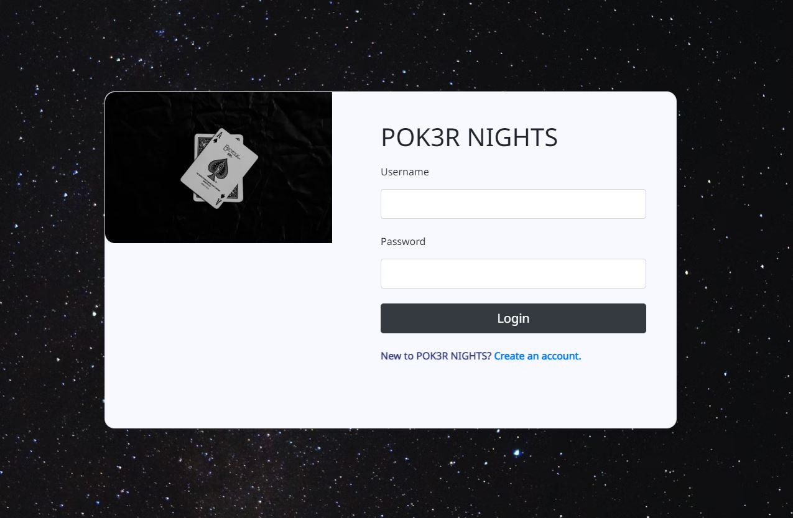
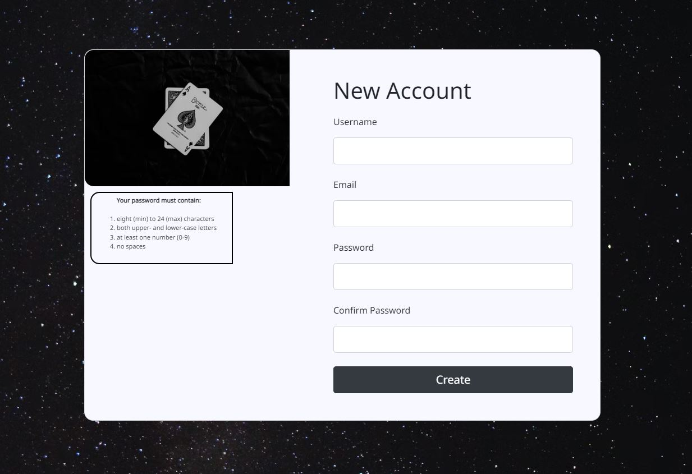
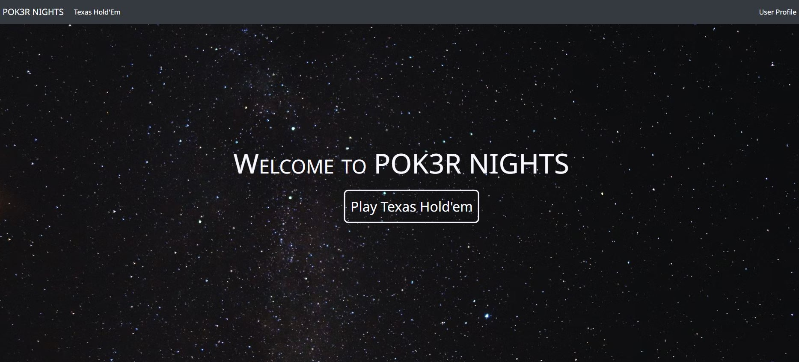
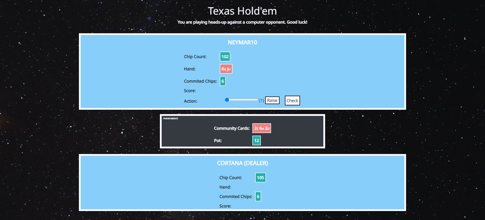

# POK3R NIGHTS

This application is designed to introduce users to the game of poker. It is an invaluable guide to both traditional and non-traditional variants: texas hold'em, pineapple, omaha hi-lo, seven card stud, midnight baseball, and criss cross.

## Link to Live Demo

[POK3R NIGHTS BETA](https://pok3r-nights.herokuapp.com/)

## A One-paragraph History of Poker

In 1829, a group of degenerate French settlers brought the game of poker to New Orleans. From there it spread like wildfire, and quickly transformed itself from a dangerous game for outlaws to one embraced by the masses drawn to its elements of risk, competition, and consequence. It has drawn millions of viewers on live national television, and inspired blockbuster movies like Rounders (1989) and Molly's Game (2017). It is a game for everyone. A game for the average Joe playing with friends at a local bar, and a game for the billionaire playboy looking for an adrenaline rush. It is a game for you.

## Important Notes on Hand Rankings, Rules, and Objectives

This useful graphic from 888poker depicts 10 poker hands ranked from best (Royal Flush) to worst (High Card):

The following rules apply to **texas hold'em**, the most popular version of poker and the perfect place to start if you are a beginner.

* **Objective**: make the best possible five card hand using any combination of the two cards in your hand plus the five community cards.
* **Set-up**: each player is dealt two cards, face down.
  * The player sitting directly to the left of the dealer must place a small blind bet, and the player sitting directly to their left must place a big blind bet.
* **First Round of Betting**: The player sitting directly to the left of the big blind has the opportunity to play first. They can either fold, call, or raise. Every other player will have the same three options. For each round of betting there is a maximum of one bet and three raises allowed.
* **The Flop**: After the first round of betting, the dealer will burn one card, and then place the next three face-up in the middle of the table. These are the first three community cards.
* **Second Round of Betting**: After the flop, the player sitting directly to the left of the dealer will have the opportunity to play first. They can either check, raise, or fold. Then, the other players who are still engaged in the hand will have an opportunity to check, call, raise, or fold. Remember, for each round of betting there is a maximum of one bet and three raises allowed.
* **The Turn**: After the second round of betting, the dealer will burn one card, and then place the next card face-up in the middle of the table. This is the fourth community card.
* **Third Round of Betting**: The player sitting directly to the left of the dealer will have the opportunity to play first. They can either check, raise, or fold. Then, the other players who are still engaged in the hand will have an opportunity to check, call, raise, or fold. Remember, for each round of betting there is a maximum of one bet and three raises allowed.
* **The River**: After the third round of betting, the dealer will burn one card, and then place the next card face-up in the middle of the table. This is the fifth and final community card.
* **Final Round of Betting**: The player sitting directly to the left of the dealer will have the opportunity to play first. They can either check, raise, or fold. Then, the other players who are still engaged in the hand will have an opportunity to check, call, raise, or fold. Remember, for each round of betting there is a maximum of one bet and three raises allowed.
* **The Showdown**: after the final round of betting, all of the players who haven’t folded will reveal their best five card hand. The player with the best hand wins.

## Noteworthy Features

### User Login Form

Users login with their unique username and password.

### Create a New Account

New users can create an account with a unique username and email address. Note, all passwords are hashed *before* being stored in the database.

### Successful Login Landing Page

After a successful login, users are directed to this landing page.

### Texas Hold'em Gameplay

During gameplay all relevant information -- chip count, hole cards, community cards, pot, etc. -- is clearly displayed. Users have the option to check, raise, call, or fold (when appropriate).
